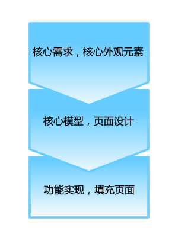
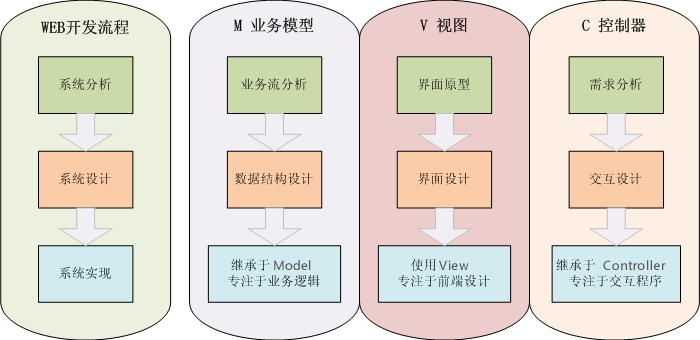

## 开发流程

SpeedPHP框架推荐两种PHP系统的开发流程。

开发流程，在许多软件工程的书籍上面，是属于开发方法学的一部分内容。开发方法学可以说是保证项目成功的整体方法，有兴趣的朋友可以参考相关文章或到论坛讨论。而开发流程，就是开发方法学中最基本的组成部分。

>本章内容均为个人经验所总结，并在实践中多个项目中证实了其有效性，但在一般方法学的书上找不到对应的方法学理论（有相似的），读者朋友有建议或问题欢迎到论坛讨论。

### 一、快速迭代开发流程

我们介绍的第一种开发流程，是快速迭代开发流程。快速迭代开发流程主要的对象是中小型应用程序、在需求不太明朗或探索阶段使用，根据WEB系统开发的基础过程，在最短的时间内把根本的需求功能完成并发布，在发布的时候尽可能收集用户反馈，然后进入下一轮的类似开发过程中；不停重复该过程，使得系统需求在实践中不断根据用户需求而完善。

**使用对象**：

- 需求不明朗的项目，
- 创业型项目，
- 试验型项目，
- 中小型应用程序等。

**核心词**：快速发布，迭代完善

**示意图**：

**实施步骤**：

#### 1. 核心需求，核心外观元素

定下项目的核心需求，核心需求就是你的项目与别的项目不同的地方，或者说，如果没有核心需求，那么该项目也没必要存在。

一般而言，创业型的项目，核心需求就是“满足用户某一需求”，如hao123网站，核心需求就是满足用户“网址导航”的需求、如企业网站，核心需求有可能是宣传企业、或宣传产品、或吸引在线订单等。核心需求最好只有一个，才能更快更好地发布和完善，才能更好地增强到最大收益。如果有多个核心需求怎么办？如果你的项目是上面所述的“使用对象”，那么初期项目核心需求应该只有一个，然后在迭代期间加入其他需求，根据用户的反馈再行修正。

核心的外观元素，如网站外观、LOGO、域名等。这些元素，从一开始就是为了核心需求服务，所以要注意不能喧宾夺主，不要为了外观设计而弱化和转移了网站的核心需求。

#### 2. 核心模型，页面设计

当核心需求定下后，可以开始设计核心模型，以此同时可以开始页面的设计（如果是团队开发的话）。

核心模型，主要是定下数据表的基础结构，还有用户操作的模拟。

从核心需求出发，考虑用户对核心需求的多个操作（可以说成页面交互）、用户可以得到的数据等。这样可以初步确定需要的是哪些数据（数据基础结构），还有需要哪些页面（用户操作模拟）。

在核心模型的建设的同时，页面外观设计也可以同步进行。

> 结合SpeedPHP框架开发，核心模板可以定义了model类（主要是数据表）和controller类（页面与交互），页面外观设计可以定义了view模板。

定义模型可以直接通过写PHP类文件来进行，如controller类，开发者可以根据页面交互，设计出相应控制器与动作；当然，我们主要是需要架构，动作内部的代码可以等到下一步骤再编写。

通过这一步骤，我们大略可以得出应用程序的整体架构，并写出部分的代码了。

> 得出大体的程序架构而不是一开始就些内部代码，好处就是可以让开发者有了整体观，对系统和项目需求有了一个整体的概念，“了然于胸”，这样在代码实现阶段才不会迷失在代码和功能延伸的旋窝中。

#### 3. 功能实现，填充页面，上线运行

当核心模型完成后，页面设计稿也逐渐完成的时候，可以开始功能的实现；通俗些说就是“套页面”了。

这一步骤主要的工作流程：controller中，从$_GET/$_POST里面获取到用户提交数据和操作数据，然后通过model进行数据库的读取与写入，返回给controller再通过$this->赋值到模板中，最后在模板中完成标签的使用和显示。

在完成了以上三个步骤之后，项目基本可以用了。由于上面的步骤省去了许多“非核心”的需求（因为一开始就只考虑核心需求，所以后面的设计和编程都只围绕在核心需求来做），所以上面步骤完成的时间比较短，一般而言，也很简陋。不过没关系，我们慢慢完善——根据真正的用户需要！

#### 4. 收集反馈，收集数据，筛选需求

收集用户反馈，项目上线后，给用户使用核心的功能，并建立良好的反馈通道，热心收集用户提出的反馈。

用户是没有耐心的、只会很直观地提出看法。要导引用户提出反馈和理解用户的看法，是一项需要非常用心的工作。

收集客观数据，在项目上线后，还需要收集“访问统计分析”、“注册人数”、“使用人数”等等客观数据来辅助验证用户反馈。

收集好了用户反馈后，就开始将这些反馈进行筛选，使其成为下一步迭代开发的“核心需求”。

筛选用户需求：

- 不要先入为主。这是需求分析中最严重的问题，有的开发者本身就对系统需求有所看法并且自认为是最好的看法，然后会将用户的反馈分成两类：“正确，赞同我看法的”和“错误，不赞同我看法的”。这样的角度来看待用户反馈，倒不如不要看用户反馈了。
- 不要忽略“很笨”的意见。用户有可能会提一些咋一听上去是令人啼笑皆非的建议，但深思下来，有可能那是非常有价值的意见。
- 关注与核心需求有关的细节。只关注与核心需求相关的细节。
- 和原有核心需求不同的意见，要特别注意和仔细思考。

#### 5. 迭代开发

在提炼出再一次的核心需求后，我们开始进入第二轮的“迭代开发”，也就是第二次开发过程。

- 重复上面所述1~3步骤，将新补充完善的核心需求变化为现实。
- 在原有系统基础上，继续调整和改动。由于前面所述的第二步骤的框架MVC架构，所以可以让调整和改动变得更简单。只是对相应的部分进行改动，如数据调整改model（或者继承等方法）、交互增加了调整controller、页面改动调整view模板。
- 在第二次开发完成后，继续收集用户反馈，以调整需求并进行开发。这就是“迭代”开发的含义。

### 二、基于MVC架构开发流程

这里介绍的第二种开发流程，更倾向于传统的过程式开发流程。可以说是融合WEB系统开发的特点和传统的过程式开发流程的综合。

**使用对象**：

- 需求较明确的项目，
- B/S应用类系统（非网站），
- 较大型的应用系统等。

**核心词**：基于MVC的系统分析、系统设计、系统实现。

**示意图**：

本过程共有三个阶段，分别对应传统开发流程的：分析、设计、实现，然后每阶段都可以分开MVC三部分来进行。

**实施步骤**：

#### 1. 系统分析

和传统开发流程一致，首先我们对系统进行分析工作。我们可以将系统分成三类来进行分析：

- 需求分析（control）：提炼角色，再现角色与系统交互的场景，分析交互点。
- 业务流分析（model）：检视和模拟业务流的走向、变化，静态观察业务数据构成和使用。
- 界面原型（view）：设计界面原型，验证上面两者分析的正确性和合理性。

产物：需求分析文档，业务数据分析文档，界面原型。

#### 2. 系统设计

在系统设计阶段，我们同样分开三部分来进行：

- 交互设计（control）：将前面《需求分析文档》中的“交互场景”设计成控制器（controller），场景中的交互点，设计成控制器的动作（action），换句话说，也就是页面。
- 数据结构设计（model）：从《业务数据分析文档》提炼出业务模型（model），细化模型的接口，并根据其属性来建立数据结构。
- 界面设计（view）：开始设计用户界面和系统界面，以验证先期需要达到的需求。

产物：控制器架构、模型架构、数据结构、界面设计稿。

#### 3. 系统实现

在系统实现阶段，开发团队通常可以并行地分别进行业务逻辑、界面和程序交互的设计：

- 专注于交互程序（control）：继承于spController，通过对控制器和动作的交互程序编程，来实现系统交互功能，以及将数据发送到前端界面view中显示。
- 专注于业务逻辑（model）：继承于spModel，通过对业务逻辑和数据的封装，制造只通过接口与外界联系的模型类，供给控制器使用。
- 专注于前端界面设计（view）：通常，使用模板引擎技术将控制器提供的数据进行简单的逻辑处理并显示。

产物：完成系统。

以上就是基于MVC的系统分析、系统设计、系统实现的过程。其实以上两种方法学可以并存在同一个过程中，这需要开发者根据实际情况来灵活应用。

> 简而言之，任何的方法学或者过程，都是希望能在最短的时间内，做最优质的项目；如何保证质量以及按时，开发者可以多探讨。

另外，从SpeedPHP框架本身而言，良好的编码架构是保证了开发流程成功的一个要素；同时，SpeedPHP比起其他框架而言，更简单易学，这也让开发团队可以节省下成员更替的空档时间和节省上手时间，这也符合了“最短时间”的需要。

