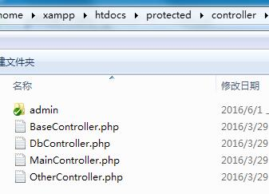

##模块modules

模块开发是工程化开发的一个概念，指的是通过多个现成或半成品的代码模块，组成较大规模的系统。模块开发模式从Ruby On Rails开始流行，并且相当部分PHP框架都支持。

新版SP框架，从底层支持模块开发，以方便开发者使用。

> 3.1版SP框架可以通过多入口的方式，简单达到模块开发的效果。

**注意**

模块开发最早是为了多个应用共享服务器而出现的（ROR），但PHP系统从执行方式和应用场景来说，更适合单应用的开发。所以比较理想的方式是通过多个单引用+域名的方式来代替模块开发，会有更高的开发效率。

**模块目录**

模块目录放置在protected/controller下面，该目录下每个子目录都是一个模块，模块名称为目录名称。

上图中的admin目录即是一个模块。

**模块文件**

模块目录内，是一套单独的控制器，模块包含自身独有的BaseController，该模块BaseController可以：

1. 模块独有的权限认证、
2. 模块范围内改变layout布局、
3. 独立的弹窗提示和404页面、
4. 其他BaseController可以覆盖的点...

模块内其他的控制器文件和普通的控制器文件没区别。

**访问**

访问模块内的控制器，需要在url()函数上加入**m参数**，如：

http://localhost/index.php?m=admin&c=main&a=index

那么就是进入admin目录的MainController的actionIndex()方法。

当使用了伪静态，在路由规则上就是&lt;m&gt;来指代控制器名称。

具体模块的伪静态规则，请参考《[伪静态及URL跳转](访问交互-伪静态及URL跳转.md)》一章。

