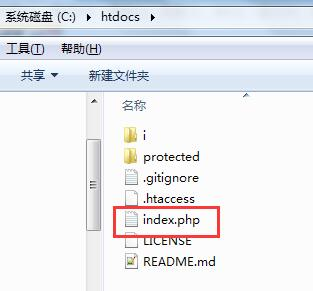
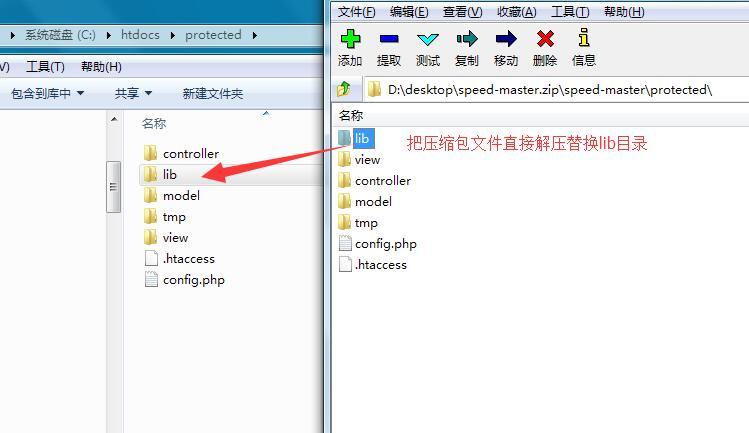

## 快速入门一、开始使用SpeedPHP

SpeedPHP是一个以快速学习为基础的PHP框架，因此不仅在程序的设计上力求简单易用、注释完整；并且在教程的写作上，也是做到图文并茂，重点突出，尽力让框架使用者在最短的时间内理解和开始使用SpeedPHP框架（以下简称sp框架）。

本章将阐述下载框架和开始运行您的SpeedPHP程序。

1.首先我们得下载入门教程的例子程序：[下载](images/1.zip)

请将下载后的压缩包解压到您的服务器的目录中（如您的服务器根目录是C:\htdocs，就解压到C:\htdocs目录内），保证**index.php**文件在根目录中。

2.下载最新版的框架文件，进入[www.speedphp.com](www.speedphp.com)。在下载栏目中下载最新稳定版本的SpeedPHP框架。

下载后的压缩包内，解压出lib目录的全部文件替换到前面C:\htdocs\protected\lib里面的文件。保证框架文件是最新版本的。

3.访问服务器网址（如http://localhost/），您将会看到sp框架的欢迎页面。

至此，您的sp框架已经正常运行了，您将可以在这里开始您的学习和使用。

> sp框架的推荐环境为Apache2 + PHP5 + MySQL5。本机服务器软件推荐使用XAMPP（ https://www.apachefriends.org/zh_cn/index.html ）。

