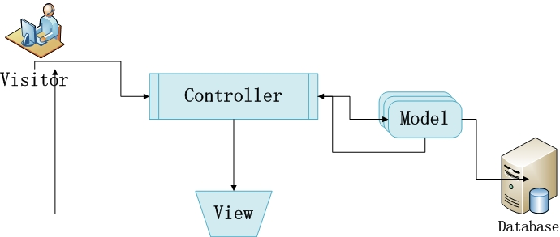
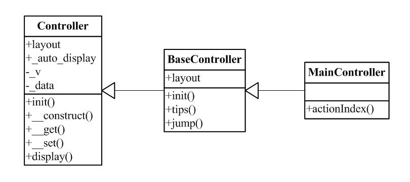

## 快速入门三、理解MVC

本章将讲述在网络系统（WEB系统）开发中，MVC（模型-视图-控制器）架构的理念、设计以及在sp框架中的实际应用方式等。

首先我们来看看MVC架构的示意图：

从上图我们可以将MVC简单地理解成：

和访问者交互的是控制层（Controller层），控制器（controller）是同类交互的集合，每一个交互的操作，都对应了一个动作（action）。在sp框架中，全部的控制器类都必须继承于Controller。

> 由于需要比较方便的进行全局控制操作，所以sp加入BaseController的级别，从继承关系来看是普通的Controller继承于BaseController，而BaseController继承于Controller。以下是层级关系图。

> 加入BaseController后，很多公共的全局操作可以放到BaseController里面来进行，如权限控制，全局提示信息封装等。

对数据库进行存取的是模型层（Model层），在sp框架中，全部的模型器类都必须继承于Model。

显示页面模板的是视图层（View层），在sp框架中，视图层被集成到了控制器内，所以在实际开发中，视图层所要制作的只有页面模板。

上面简单描述了MVC架构的理解。下面讲述一下关于sp框架中的MVC理念，可能比较抽象而不好理解，但是还请耐心去阅读，毕竟在实际开发中，对MVC理念的理解是非常必要和重要的。

sp框架中的MVC理念，是将网络系统划分为三个关注点：交互、数据、页面模板；也就是我们设计或分析一个网络系统，就可以从这三个角度去进行：

**交互**：

表现在系统提供了哪些功能，这些功能可以划分为哪些大类，每一个大类的功能分别都有些什么操作等等。

比如PHP论坛系统，我们可以粗略划分成板块、帖子、用户、站内信息、后台管理等几大类的功能，然后用户的功能里面又包括了注册、登录、修改用户信息等等的多个操作。

> 对应sp框架的控制层（controller层）而言，一个功能大类可以说是一个控制器类（当然，如果该类型概况的范围比较大，那么还需要继续拆分成多个控制器类），单个类型内的每一个功能就是一个动作（action，控制器类的方法函数）。然后根据访问者对系统的每一次操作，sp框架都会自动选择对应控制器类中的对应动作进行处理。

> 新加入的BaseController，可以理解成在各种功能之上的一个通用的功能集合。

**数据**：

表现在系统对数据库进行了那些操作。网络系统几乎都需要和数据库打交道。那么，在进行对交互的分析和对系统本身的分析后，我们也大致上可以归纳系统需要哪些数据了。然后我们将这些数据整理归类，最终可以得出系统需要的数据表是哪些。

就刚才的PHP论坛，按照“板块、帖子、用户、站内信息、后台管理”这五个分类功能，我们可以基本归纳出它们需要：板块记录表、帖子记录表、用户表、站内信息表、后台设置表等等。

> 对应sp框架的模型层（Model层）而言，一个表可以说就是对应了一个模型类。而sp框架中的模型父类（spModel）为这些模型类提供大部分与数据库存取的功能。

**页面模板**：

每一个网络系统的开发中，我们都将需要制作相当数量的页面。简单来说，控制器的每一个动作（action）都有可能产生一个页面，所以在理清所有交互，完成控制器的设计后（未写代码前），我们就可以得到需要的页面模板的清单了。然后在模板引擎的帮助下，页面模板的制作可以与控制器的开发同时进行，以提高开发效率。

按照上面的PHP论坛交互的设计，那么我们可以得到的页面模板有许多，比如板块方面，有首页模板、分区模板、板块模板等；帖子方面有帖子内容模板、发帖模板、回帖模板等。

>sp框架将视图层（View层）集成到了控制器内，所以在开发中，控制器将会把需要的数据发送到模板上面。而视图层所需要的开发，就仅是按照模板的语法进行页面模板的制作即可。

根据“交互、数据、页面模板”这三个关注点，那么我们就可以比较全面地去分析和设计一个网络系统了。请注意这三个关注点并非孤立的，而“交互”正是“数据”与“页面模板”的基础，所以对“交互”的分析务必要做到正确并且完善。如果您希望了解更多关于系统分析与设计方面的知识，请到sp网站上面阅读相关文章。

当我们理解了MVC后，下一步我们可以开始进入实战，来制作一个简单的留言本程序了。 