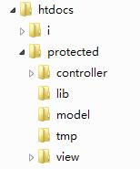
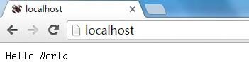

##快速入门二、Hello World

许多编程语言都以“Hello World”这个经典的程序为开始，我们也可以从它来开始我们的sp之旅。以下，本章将介绍基于SpeedPHP的“Hello World”程序，同时介绍了sp框架基础程序的写法。

接着上一章已经按照好的sp框架程序，您的本地服务器上应该是以下的目录结构：



进入controller目录，打开MainController.php文件，您可以看到：
```
<?php
class MainController extends BaseController {
	function actionIndex(){
		echo "Hello World";
	}
}
?>
```
将以下代码：
```
echo "Hello World";
```
替换红色部分的代码：

```
echo "SpeedPHP框架已经正常运行，欢迎使用！";
```

如何打开PHP文件？请使用windows自带的记事本，或者可以使用EmEditor或者EditPlus（Google一下就可以找到）。

打开您的浏览器，输入http://localhost/，您将可以看到：



