## 快速入门五、数据操作及Ajax

前面的教程我们已经完成了一个留言本的初步开发。接下来我们来了解一下sp框架的数据操作，以及初步学习一下Ajax的开发方式。

> Ajax是异步Javascript技术，可以在页面没有刷新的情况下，从服务器接收新的内容来显示和操作。

> 时至今日，Ajax已经成为了网站开发技术的标配。

[本教程最终完成例子下载](images/5.zip)

### 一、页面调整

我们的留言本由于需要加入更多的操作，所以在页面HTML上面需要再修改一下，加入一个留言查看的弹窗。

新的HTML在这里：[下载新的页面](images/4.zip)

解压取出里面的showmsg.html文件，它只是页面的HTML片段，主要提供显示一个查看单条留言的对话框，并不是完整的页面。

将showmsg.html放到protected/view目录下面。

我们现在需要把这个页面插入到guestbook.html中。打开guestbook.html，在最下面填写留言表单的下方，我们加入一行代码：

    <{include file="showmsg.html"}>
    
看起来大概是这样：
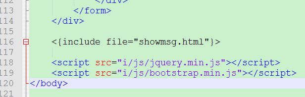

刷新localhost后，右键查看源代码，我们会发现showmsg.html的内容已经放在include那个位置上了。

> 这是sp框架模板引擎的include语法功能，具体了解可以参考手册相关内容。

> inlucde语法的好处是可以把模板内通用的HTML片段抽离出来独立成文件，方便其他模板文件引用进去，达到一次修改就可以改变所有引用的内容。

### 二、查看单条留言

我们在protected/controller目录下面，新建个php文件，名称是：ViewController.php，里面内容是：

    <?php
    class ViewController extends BaseController {
        function actionShow(){
            // 把提交的upid参数，作为值来构造一个查询条件数组，
            // 条件是：把id字段中等于提交upid参数值的记录查询出来
            $condition = array("id" => arg("upid"));
            $guestbook = new Model("guestbook");
            // 通过find()方法，按条件数据进行查询，
            // find返回结果是对应记录的一维数组
            $result = $guestbook->find($condition);
            // 输出看看
            dump($result);
        }
    }
    
当我们打开浏览器http://localhost/view/show.html?upid=1 ，可以看到：

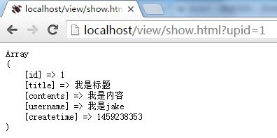

内容比较多，我们仔细来研究研究：

- 这里是ViewController类，跟MainController一样，它继承于BaseController类，而且类的名字跟文件名是一样的。
- ViewController类里面的方法叫actionShow()，action开头的方法是可以被浏览器访问到的。actionShow()是执行这块操作的主体代码块。
- actionShow()方法开始我们把提交上来的参数upid，作为值构造成了一个查询条件的数组，数组名称是$condition。
- arg("upid")代表获取浏览器提交上来upid的参数。
- 继续实例化guestbook表，然后调用find()方法，用$condition这个条件数组作为参数输入。
- 取得find()方法的结果$result，并且用dump()进行调试输出观察。

Model类的find()方法，指的是查询一条符合条件的记录，返回的是一维数组。

对比一下前章节学习过的findAll()方法，我们把上述代码的find()直接改成findAll()。

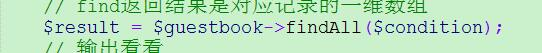

刷新浏览器我们可以看到跟find()的一点不一样的地方了：

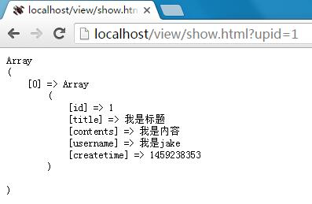

是的，findAll()比find()的结果多了个0，也就是多了一个维度。

> 从原理上来讲，find()方法内部其实是调用了findAll()来查询，但是会指定只返回第一条记录，然后find()会把第一条记录变成一维的数组再返回给用户。

也就是说，find()实际上是findAll()的第一条记录，不过find()相对方便的是它是一维数组，可以直接通过类似$result["title"]的方式来取得值，而不是findAll()结果的$result[0]["title"]。

> 相同条件下，find()的$result["title"]是等于findAll()的$result[0]["title"]的。

这时候我们已经可以指定查询到了单条留言的内容了。那么我们会把返回变成json格式。

> json格式是目前较为通用的数据传输格式。

我们现在把dump()调试去掉，改成json输出：

    <?php
    class ViewController extends BaseController {
        function actionShow(){
            // 把提交的upid参数，作为值来构造一个查询条件数组，
            // 条件是：把id字段中等于提交upid参数值的记录查询出来
            $condition = array("id" => arg("upid"));
            $guestbook = new Model("guestbook");
            // 通过find()方法，按条件数据进行查询，
            // find返回结果是对应记录的一维数组
            $result = $guestbook->findAll($condition);
            // 输出看看
            header('Content-type: application/json');
            echo json_encode($result);
        }
    }
    
- header()函数的作用是输出后让浏览器识别这是一个json流。
- json_encode()函数是php自带函数，可以将php数组转换成json格式，这里转换好了之后，就echo输出了。

> 跟json_encode()对应的还有json_decode()函数，作用相反，将json格式转回php数组。
> echo是输出的意思，比如我们最早的 echo "hello world";，当然我们这个页面是没有用到模板的（没有display），是直接输出的。

刷新浏览器我们可以看到json的输出了：

这里看起来像是乱码的东西，就是json格式的数据。

---

接下来我们修改一下HTML，对，就是插入那个showmsg.html

    

		

			

				

					<button type="button" class="close" data-dismiss="modal" aria-label="Close">&times;</button>
					<h4 class="modal-title" id="show_title"></h4>
				

				

					

					<blockquote class="blockquote-reverse small">
						<ul class="list-inline text-muted">

							<li>by</li>
							<li id="show_username"></li>
							<li id="show_createtime"></li>
							<li>
								<button type="button" class="btn btn-default btn-xs"> 100</button>
							</li>
						</ul>
					</blockquote>
				

				

					<button type="button" class="btn btn-default" data-dismiss="modal">关闭</button>
				

			

		

	

	
    
我们修改了不少地方，逐个来看看。

- 在每个需要显示内容的HTML元素上，我们加入了id的属性，也就是分别给它们取个名字，方便通过JS来进行赋值。
- 加入了一个JS函数showmsg()，这个js函数的作用首先是调用jQuery库的getJSON()方法，把传入的id发到<{url c="view" a="show"}>这个地址上面去。
- 然后接收返回的json数据，一一对应填入HTML里面。
- 最后把对话框显示出来。

> JS是Javascript的简称，JS是可以在网页上面执行的脚本程序。具体JS教程可以参考w3c的教程。
> 由于本身页面模板上面已经有jQuery库，故不再需要引入可以直接使用。jQuery是JS的一个流行的类库，非常有用，建议多学习。

我们还需要给每个留言增加个启动showmsg()函数的链接。在guestbook.html里面，我们把循环里面的标题增加一个链接。

把原来的：

    <h4 class="media-heading"><{$r.title}><button type="button" class="close" aria-label="Close">&times;</button></h4>
    
改成了：

    <h4 class="media-heading"><a href="javascript:void(0);" onclick="showmsg(<{$r.id}>)"><{$r.title}></a><button type="button" class="close" aria-label="Close">&times;</button></h4>

- onclick是HTML的一个事件，意思是点击后发生点什么，这里的代码指的是“当点击这个链接时，指向地址是空的，但是会启动JS函数showmsg()”
- showmsg()函数传入了当前留言的id值。

保存，刷新浏览器。点击任何一条留言的标题，那么就可以看到：

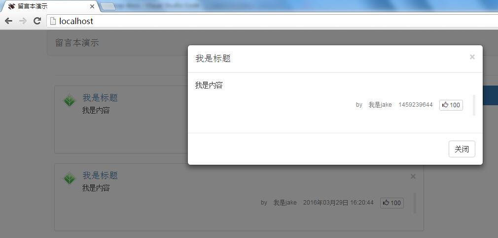

这里弹出的内容，是通过Ajax从view/show里面获取到的。

### 三、点赞

看到每个留言下面的大拇指标志吗？ 通常在网络上这是点赞的意思。我们来实现这样的功能吧。

点赞通常是一个数字，所以我们需要在原来的数据表guestbook上面新增一个数字字段来存储它，名字就叫dig。这里是通过PHPMyAdmin增加的界面：

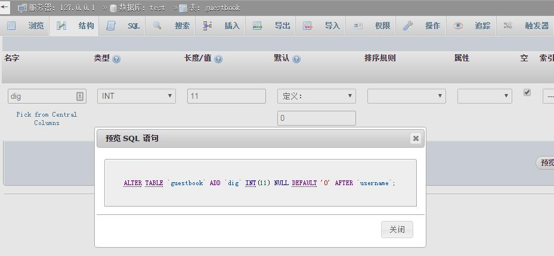

对应的SQL语句是：

    ALTER TABLE `guestbook` ADD `dig` INT(11) NULL DEFAULT '0' AFTER `username`;
    
完成后我们可以看到dig字段已经在那儿了。

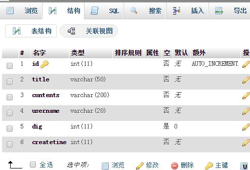

打开ViewController.php，增加一个action作为点赞操作的方法。

	function actionDig(){
		// 同样的，首先是根据提交参数确定条件
		$condition = array("id" => arg("upid"));
		$guestbook = new Model("guestbook");
		// 先查出当前记录的点赞数是多少
		$result = $guestbook->find($condition);
		// 然后把点赞加一
		$dig = $result["dig"] + 1;
		// 建新的更新数据，跟create相似的
		// 是需要更新的字段名对应新的值
		$newrow = array("dig" => $dig);
		// 执行更新操作
		// 这里update的意思是把符合$condition条件的记录
		// 按$newrow设定的字段，把这些字段的值改成新值
		$guestbook->update($condition, $newrow);
		
		// 然后直接显示更新后的点赞数
		echo $dig;
	}

- 首先我们是查询出来对应的id记录的dig数量是多少，然后加一。
- 再通过update把加一后的值更新回去
- 最后显示一下新的值

update()方法输入两个参数，前面参数是条件数组，后面参数是需要更新的字段+值。

> 从使用方式来看，update()方法很像是find() + create()的组合。

然后在guestbook.html页面上面，我们修改一下点赞显示的方式，加入onclick事件。

> 因为点赞显示的位置没有元素，所以我们可以用span把数字包裹起来，这样就可以给它赋以名称id了。

    <button type="button" class="btn btn-default btn-xs" onclick="digmsg(<{$r.id}>)"> "><{$r.dig}></button>

首先我们刷新一下页面，会发现点赞数已经出来了——当然只有0。

然后我们在showmsg.html的script里面，再加上digmsg()函数：

    function digmsg(id){
        // 这里不需要json返回，所以直接使用$.get即可
        $.get("<{url c="view" a="dig"}>", {"upid" : id}, function(dig){
            $("#dig-" + id).html(dig);
        });
    }
    
这里我们有个小技巧，就是在页面foreach循环的时候，点赞位置的id是dig-<{$r.id}>，所以每条留言的这个id都是不一样的，所以在 $("#dig-" + id).html(dig);就可以把返回的数据填充到正确id的点赞位置了。

完成后我们刷新一下浏览器，发现点赞数字可以点击了，并且点击后，数字会变大。

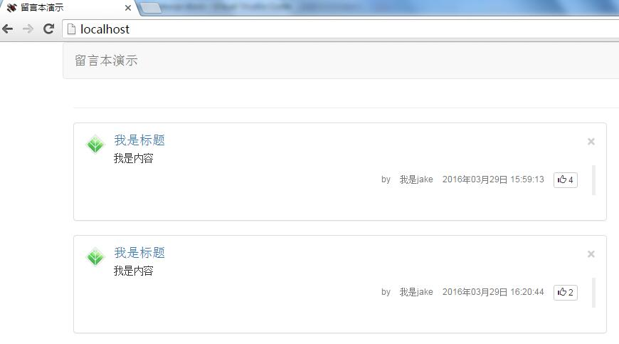

最后我们还需要修改一下查看留言的弹出框，把点赞数也显示上去。

包括把弹出的HTML点赞位置改为：

    
    
JS函数showmsg()里面也要增加：

    $("#show_dig").html(json.dig);
    
改好后弹窗框也OK了：

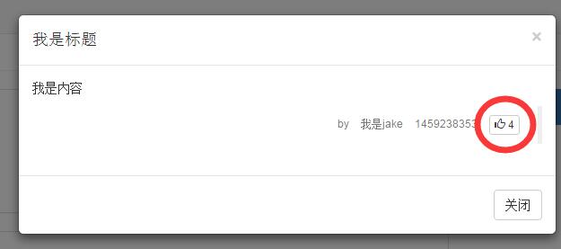

### 四、时间显示的补充

从上图弹出框可以看到留言时间还是时间戳。我们来把它修改一下成好看的日期吧。

在ViewController的actionShow()方法里面，我们加入一个转换：

    $result["createtime"] = date("Y年m月d日 H:i:s", $result["createtime"]);
    
放在查询到$result后，还没有输出之前。大概的位置是：

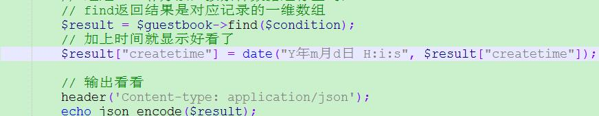

那么弹出框时间也就正常了。

> 这里介绍的技巧，是当查询到数据之后，其实还是可以进一步修改的，有时候我们在php端修改，会更方便点。

### 五、删除留言

一般数据库操作，最基本的就是增删改查（CURD），分别是增加（create）、删除（delete），修改（update），查询（find/findAll）。增改查前面已经介绍过了，我们现在来介绍最后一个删除操作。

> CURD的查询是英文READ，但是我们比较喜欢用find/findAll，这是文法的问题。

打开ViewController.php，增加一个action作为删除操作的方法。

	function actionDel(){
		// 同样的，首先是根据提交参数确定条件
		$condition = array("id" => arg("upid"));
		$guestbook = new Model("guestbook");
		
		// 直接返回结果，实际上这个结果是被忽略的
		echo $guestbook->delete($condition);
	}

删除操作相对简单，跟其他操作一样，先是确定数组条件，然后直接调用delete()方法。

delete()方法只有一个参数，代表了删除记录的条件。

接下来我们修改guestbook.html文件，首先我们把foreach循环留言的大块DIV，加入一个ID，以识别不同的留言。

    
">

然后在每个留言的右上角，已经有个 x 了，这是一个删除按钮。我们加入事件给它。

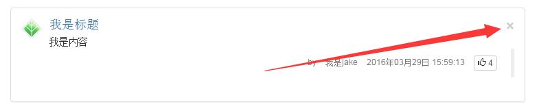

代码是：

    <button type="button" class="close" aria-label="Close" onclick="delmsg(<{$r.id}>)">&times;</button>
    
具体部分代码是：

    ...
    

        <{foreach $records as $r}>
        
">
            

                

                    

                        
                    

                    

                        <h4 class="media-heading"><a href="javascript:void(0);" onclick="showmsg(<{$r.id}>)"><{$r.title}></a><button type="button" class="close" aria-label="Close" onclick="delmsg(<{$r.id}>)">&times;</button></h4> <{$r.contents}>
                        <blockquote class="blockquote-reverse small">
                        ...
                        
然后我们还是在showmsg.html的script里面，再加上delmsg()函数：

    function delmsg(id){
        // 这里不需要json返回，所以直接使用$.get即可
        $.get("<{url c="view" a="del"}>", {"upid" : id}, function(){
            $("#panel-" + id).fadeOut();
        });
    }

- 这里实际上不需要返回值，所以也没有赋值给返回值。
- fadeOut()是一个很好玩的动画效果，会让页面上的元素渐变消失。

OK后我们来刷新一下页面，点击其中一个留言右上角的叉，留言就消失了。

### 六、分页显示

当我们留言内容变多的时候，页面会变得很长，这时候我们需要对留言进行分页显示。

> 分页也是比较基础的功能之一，大部分网站都可以见到它的身影。

> 另外在我们的页面上，其实也是有分页的HTML在的。

我们先来介绍一下关于findAll()方法的深入使用方法。

findAll()方法有四个参数，依次是$conditions，$sort，$fields，$limit；

- $conditions是条件数组，默认情况下是字段对应值的查询条件。
- $sort是排序方式，比如说接下来我们会用到“createtime DESC”就是根据createtime创建时间倒序查询。
- $fields是查询出来的字段，一般是“*”即可。
- $limit是限定查询的数量，也是我们分页的基础。默认情况是“第几条，要几条”，比如说“10, 20”指的是从第10条记录开始，查出20条数据。

除了限定条数，$limit还有一种分页的方法：数组形式的$limit是自动分页的功能，指的是array(第几页, 每页多少条);如如 $limit = array(10, 20);，就是查出第10页，每页20条记录。

> “查出第10页，每页20条记录”，我们可以知道实际上findAll出来的结果最多是20条。

打开MainController文件，我们修改一下actionIndex()方法。

	function actionIndex(){
		// 接收页码参数
		$page = (int)arg("p", 1);
		
		// 实例化一个guestbook的模型类
		$guestbook = new Model("guestbook");
		// 用findAll()方法查询guestbook表的全部数据
		$this->records = $guestbook->findAll(null, "createtime DESC", "*", array($page, 3));
		// 输出看看
		// dump($this->records);
		
		$this->pager = $guestbook->page;
		// dump($this->pager);

		$this->display("guestbook.html");
	}
    
改后我们发现页面上只有3篇留言了。下面我们来研究研究：

**页码**

- 接收页码$page，我们用了arg("p", 1);后面参数1是代表如果p不存在，则返回1.
- (int)arg("p", 1)的意思是强制将p参数转换成数字，保证数据库安全。

**findAll**

    $guestbook->findAll(null, "createtime DESC", "*", array($page, 3));

这里用了findAll的四个参数：

- null指的是没有条件，查询全部内容。
- "createtime DESC"指的是按createtime倒序查询，如果是正序那么应该是"createtime ASC"。
- "*"是全部字段，默认这个就好。
- array($page, 3)，这里指的是：当前是第$page页，每页3条留言。

综上我们可以知道，现在$this->records查询出来的结果是第$page的3条留言。

> 因为我本机上面留言较少，所以分页只设置了3页，如果大家有兴趣可以设置大点的数字。

**page**

    $this->pager = $guestbook->page;
    
这句代码紧跟着上面的findAll查询，意思是从$guestbook里面取出上一次findAll给出来的页码数据。

> 这句代码必须紧跟着findAll，如果$guestbook再来一次findAll，那么可能$guestbook->page就不是第一次findAll的页码数据了。

$this->pager输出看看：

字段 | 含义
--- | ---
total_count | 符合条件的总记录数量
page_size | 每页多少条件记录
total_page | 总共有多少页
first_page | 第一页页码
prev_page | 上一页页码
next_page | 下一页页码
last_page | 最后一页页码
current_page | 当前页页码
all_pages | 全部页码数组
offset | 查询位移，等于$limit的第一个参数
limit | 查询条数，等$limit的第二个参数

取得页码数据后，我们就可以开始修改页面上的页面显示了。找到guestbook.html文件的约55行左右，把分页显示的nav整个修改成：

    <{if $pager}>
    <nav>
        <ul class="pagination pull-right">
            <li>
                <a href="<{url c="main" a="index" p=$pager.prev_page}>" aria-label="Previous">
                    &laquo;
                </a>
            </li>
            <{foreach $pager.all_pages as $p}>
            <li<{if $p == $pager.current_page}> class="active"<{/if}>>
                <a href="<{url c="main" a="index" p=$p}>"><{$p}></a>
            </li>
            <{/foreach}>
            <li>
                <a href="<{url c="main" a="index" p=$pager.next_page}>" aria-label="Next">
                    &raquo;
                </a>
            </li>
        </ul>
    </nav>
    <{/if}>
    
- 首先我们判断是否有分页数据，这里<{if}>标签的作用就是如果$pager为空，则不会显示整个分页。$pager为空的意思是数据表记录没有能填满一页（根据分多少页的参数）。
- 填充上一页和下一页，注意是通过url函数传递p参数的
- 循环all_pages的页码数据，显示各个页码。
- 循环过程中，会通过<{if}>做一下判断，判断显示的页码是否当前页，如果是的话，会在li上面加入一个 class="active"的属性，加亮显示。
- 最终分页上面会生成各个分页的链接。

> 之所以未满一页不显示分页，这也是对页面浏览者友好的表现，如果只有一两个留言，那么显示个点击不了的页码，甚不美观。

我们来看看最终效果：

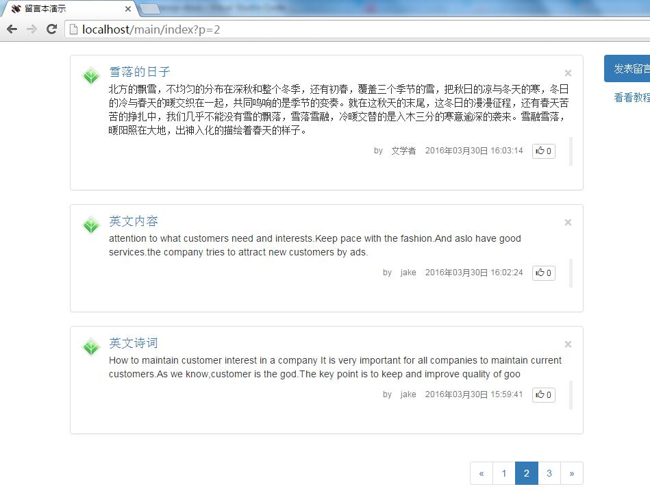

---

以上我们已经了解过简单数据操作和Ajax等相关知识，sp框架的初级内容已经介绍得差不多了。请大家继续学习我们的教程，以便了解更多相关知识。