本章让我们使用sp框架来制作一个简单的留言本程序，在实例中学习程序开发是非常有效的。同时，我们也可以体会一下实际网络项目的开发流程。

**新版手册我们打算用另一个教程方式，让大家能更容易体验到web开发的过程**。

新的方式主要是将原始的HTML页面提供下载，大家可以先下载全部页面，跟着教程来制作程序。如果期间有不明白的地方，可以下载完整的例子程序作为参考。

[下载HTML页面压缩包](images/2.zip)

[下载完整例子压缩包](images/3.zip)

> 一般在团队内进行php开发工作时，HTML页面均是由前端开发人员协助完成，然后php开发人员拿到的已经是页面成品。

> 之后php开发人员再把这些页面，使用框架等技术做成真正可以运行的web站点。

###一、代码准备

首先，解压“HTML页面压缩包”，我们可以看到一个html文件（guestbook.html）以及一个资源目录（i目录）。

1. 把资源目录i放到之前介绍的Helloworld程序的index.php同级目录。大概会是这样子。

	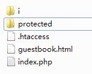

2. 然后把guestbook.html文件剪切到protected/view目录下。

	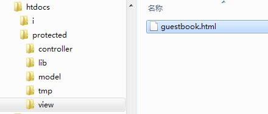

	这样图片/CSS/JS等就可以正常显示了。

---

###二、数据库准备

首先我们来看看，留言本的需求，也就是我们的程序将要实现什么功能：

- 访问者可以查看留言首页。
- 访问者可以进行留言。

> 请注意，在入门教程接下来的章节里面，我们还会介绍如何分页显示留言、用户点赞、管理员管理留言等功能的实现方法，本章仅是介绍简单留言本的制作。

> 大家可以发现留言本的HTML页面中，已经包含了这些功能的样式。那就努力完成本章并且接着学习吧。

我们来看看，在上面需求中所涉及的数据有哪些？

对，仅是留言信息。那么我们大致考虑，留言信息会包括：留言标题，留言内容，留言者名字。另外，我们留言的信息还需要包括一个唯一的标志，以区分每一条留言。好了，那么我们就可以得出，留言本程序的数据表仅有一个“留言表”（起个英文名叫guestbook），它的大致结构是：

- 留言标题，字符串（也就是中英文）形式，大概不会多于50字。用title做数据表的字段名称。
- 留言内容，字符串，也不会多于200字吧，用contents做字段名。
- 留言者名字，字符串，大概在20个字以内，用username做字段名。
- 唯一标志，一般用数字形式的ID。用id做字段名。
- 另外还有个留言时间要记录的，一般php开发我们会用“时间戳”来记录时间。时间戳是11位的数字。

按以上的说明，我们可以得出以下的数据表结构。

    CREATE TABLE `guestbook` ( 
        `id` INT(11) NOT NULL AUTO_INCREMENT , 
        `title` VARCHAR(50), 
        `contents` VARCHAR(200), 
        `username` VARCHAR(20), 
        `createtime` INT(11), 
        PRIMARY KEY (`id`)
    ) ENGINE = InnoDB CHARACTER SET utf8 COLLATE utf8_general_ci;
    
> 对于数据库知识，我们提倡的是按需学习，也就是用到哪些就学哪些，毕竟“书上讲得深奥，实际没有用到”，那就是费力不讨好。并且，在实际工作中，PHP程序员所需要的，也仅仅是一小部分的数据库知识，万一遇到更复杂的数据库需求我们也有非常多的解决途径，比如同事之间讨论，SpeedPHP论坛求助，找GOOGLE大神等等。所以除非是很有必要（比如工作是程序员兼数据库管理员DBA的人员），不然数据库知识方面，我们也是浅尝辄止即可。

> 初学PHP，我们建议可以了解一下以下的数据库知识就足够，不需要给自己太多的学习压力。

> - 在类似PhpMyAdmin的数据库管理工具中，如何建表。
> - CREATE，UPDATE，DELETE，SELECT四个语言的简单用法。
> - 懂得思考和想方法解决遇到的问题。
> - 使用数据库管理工具而不用纯粹SQL语句和命令行并没有什么荒废知识的问题，毕竟那会更简单快捷并且避免许多问题，这是提高开发效率的必然选择。

在PhpMyAdmin中建好了guestbook表：

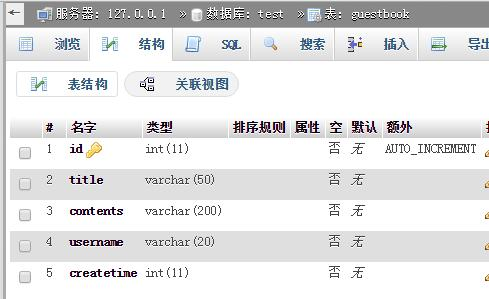

然后，我们可以在protected/config.php文件中对程序进行数据库的配置：

    $domain = array(
        "localhost" => array( // 域名必须匹配
            'debug' => 1,
            'mysql' => array(
                    'MYSQL_HOST' => 'localhost', // 数据库地址
                    'MYSQL_PORT' => '3306',      // 数据库端口，一般是3306
                    'MYSQL_USER' => 'root',      // 数据库用户名
                    'MYSQL_DB'   => 'test',      // 数据库库名称
                    'MYSQL_PASS' => '',          // 数据库密码
                    'MYSQL_CHARSET' => 'utf8',   // 编码，一般utf8即可
            ),
        ),
    );
    
这里必须注意几点：

1. $domain下面是域名，必须跟当前web站点的域名相同，比如说本机学习测试时，一般会用localhost；如果是发布到网上，如果你的域名是http://php.test.com，那么就必须设置成"php.test.com"。否则会出现500错误。
2. 数据库的配置资料，一般网上购买的主机空间都会提供，请联系主机提供商。

---

###三、显示页面

接下来，我们打开protected/controller/MainController.php文件，把原来的

	function actionIndex(){
		echo "Hello World";
	}
改成

	function actionIndex(){
		$this->display("guestbook.html");
	}
    
打开浏览器看看http://localhost ：

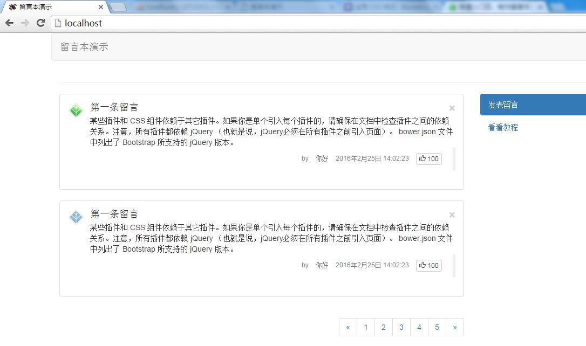

> 如果提示找不到服务器，那么请检查你的服务器有没有开启，比如说打开xampp等。

我们已经把页面给显示出来了。

---

###四、发表留言

这里我们先来开发“发表留言”的功能，毕竟要先有数据，才好显示。

还是protected/controller/MainController.php，我们加入新的方法actionWrite()

    <?php
    class MainController extends BaseController {
        function actionIndex(){
            $this->display("guestbook.html");
        }
        
        function actionWrite(){
            dump($_POST);
        }
    }
    
actionWrite()方法还是以action开头，代表了这是一个页面，里面现在只是通过dump()函数把提交的$_POST数据输出一下，方便我们验证表单提交是否正确。

> 这种dump()提交数据的方式建议大家多用用，这是非常有益的小习惯。很多时候我们会发现表单失效首先是因为提交数据不对引起的。一开始就验证提交数据会保证数据不会错。

接下来修改模板，打开protected/view/guestbook.html模板，大概在109行左右，我们可以看到有填写留言的表单form。

    <form method="POST" action="#">
    
把它的action，也就是指向地址，改为我们的提交留言地址。

    <form method="POST" action="<{url c="main" a="write"}>">
    
保存文件后打开浏览器刷新一下localhost，右键查看源代码，会发现这个地址已经变成了：
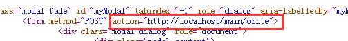

> 这里是url模板函数的功能，具体可以参考手册关于url函数的介绍。

我们点击“发布留言”，并且随便输入点什么，再点击“提交”按钮。

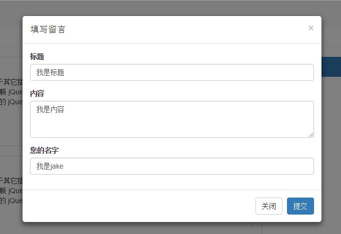

提交后会发现浏览器已经来到了 http://localhost/main/write 

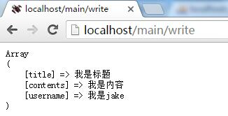

这个地址对应的就是MainController内的actionWrite()方法。

然后我们继续来编写actionWrite()方法：

	function actionWrite(){
		dump($_POST);
		
		// 构造新建留言的数据
		$newrow = array(
			"title"      => $_POST["title"],    // 字段一一对应
			"contents"   => $_POST["contents"],
			"username"   => $_POST["username"],
			"createtime" => time(),   // time()函数可以产生当前时间戳
		);
		// 实例化一个guestbook的模型类
		$guestbook = new Model("guestbook");
		// 使用Model的create方法把前面的数据插入到数据表中
		$result = $guestbook->create($newrow);
		// 输出一下结果，如果是1，那证明已经插入了1条新的数据
		dump($result);
	}
    
我们来看看：

1. $newrow是一个字段（key）和数据表guestbook字段对应的php数组，如title，contents等字段。
2. $newrow各字段的值，是提交上来的值或者是时间戳。如$_POST["title"]对应的就是模板中提交的title数据。

        <input type="text" name="title" class="form-control" id="inputTitle" placeholder="请输入标题...">
    
3. time()函数会产生一个11位的时间戳，我们经常用其来存储php的时间，这里将time()的结果存到createtime字段上面去。
4. new Model("guestbook")的方法可以实例化一个Model类，这个类对应的数据表是刚才我们建的guestbook表。
5. 调用Model类的create()方法来插入新记录，create方法接收一个数组，数组是新记录的数据。
6. create()方法返回的结果是“影响行数”，比如说新增了一行数据，那么返回就是1。这里可以把返回1当作新增记录成功的表现即可。
7. 我们来看看数据库，发现记录已经新增了。

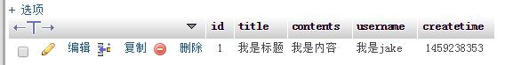

> 和旧版有点像又有点区别的地方是，Model类本身已经可以直接输入表名称，然后对该表进行实例化。而旧版是通过spDB()这个函数。

接下来我们加个“留言成功”的提示上去，把dump()输出的内容删除，那么“填写留言”的功能就完成了。

	function actionWrite(){
		//dump($_POST);
		
		// 构造新建留言的数据
		$newrow = array(
			"title"      => $_POST["title"],    // 字段一一对应
			"contents"   => $_POST["contents"],
			"username"   => $_POST["username"],
			"createtime" => time(),   // time()函数可以产生当前时间戳
		);
		// 实例化一个guestbook的模型类
		$guestbook = new Model("guestbook");
		// 使用Model的create方法把前面的数据插入到数据表中
		$result = $guestbook->create($newrow);
		// 输出一下结果，如果是1，那证明已经插入了1条新的数据
		// dump($result);
		$this->tips("留言成功！", url("main", "index"));
	}
    
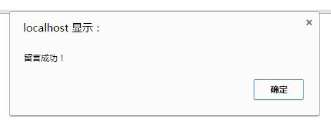

> $this->tips()方法是BaseController类自带的方法，只是弹出一个JS提示。如果需要更漂亮的提示，可以自行修改该方法的实现。

---

###五、留言列表

接下来是显示留言列表，还是protected/controller/MainController.php，我们修改一下actionIndex()方法。

	function actionIndex(){
		// 实例化一个guestbook的模型类
		$guestbook = new Model("guestbook");
		// 用findAll()方法查询guestbook表的全部数据
		$this->records = $guestbook->findAll();
		// 输出看看
		dump($this->records);
		// 为了清楚看到输出，我们先屏蔽页面输出
		//$this->display("guestbook.html");
	}
    
1. 跟actionWrite()方法一样，我们先实例化一个guestbook表的模型类。
2. 然后调用模型类的findAll()方法，得到结果是$this->records。
3. 输出$this->records看看。

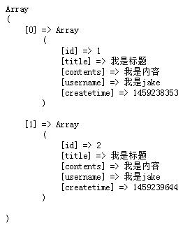

这里我们可以看到，变量$this->records的内容是一个多维数组，分别对应了数据表guestbooke里面的两条记录，每条记录的字段（key）是数据表的字段名称，对应值的是数据本身。

> $this->records这样的变量是控制器的成员变量，而这个写法跟普遍变量（比如说$records）不一样的地方是，$this->records可以在模板内直接使用。

> 也就是说，在控制器内，通过$this->赋值的变量，都可以在模板内使用；而普通的变量并没有这样的功能。

> 这也是最基础的模板引擎的用法之一。

这里看到我们希望的数据已经出现在$this->records变量中了，那么我们在模板里面来使用这些数据吧。

打开protected/view/guestbook.html文件，大概在27行左右，找到

    

    ...
    

    
这个div和它的范围（结束的&lt;/div&gt;大概在52行）。可以看出来下面还有一个相同的。这里一块div就是页面上显示的一块内容：

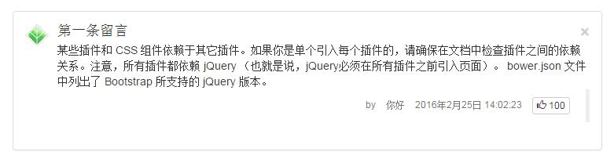

这里我们来做个循环，把$this->records变量的内容循环显示出来。

**请注意在模板内，$this->records变量对应的内容变量是$records。**

    <{foreach $records as $r}>
    

        

            

                

                    
                

                

                    <h4 class="media-heading"><{$r.title}><button type="button" class="close" aria-label="Close">&times;</button></h4> <{$r.contents}>
                    <blockquote class="blockquote-reverse small">
                        <ul class="list-inline text-muted">

                            <li>by</li>
                            <li><{$r.username}></li>
                            <li><{date("Y年m月d日 H:i:s", $r.createtime)}></li>
                            <li>
                                <button type="button" class="btn btn-default btn-xs"> 100</button>
                            </li>
                        </ul>
                    </blockquote>
                

            

        

    

    <{/foreach}>

模板内的内容，可以通过变量进行替换输出的。所以我们主要关注用<{和}>包住的部分。

1. 首先是一个大的<{foreach}><{/foreach}>，这里代表了整个区域的HTML代码会被“循环”输出，循环的次数根据$records的记录条数而定。（我们可以看到循环了两次，证明数据库里面guestbook表是有两条记录的）
2. foreach的语法跟php本身的foreach是差不多的，<{foreach $records as $r}>指的是将$records循环，然后每次循环出来的值都赋值给$r。那么每次循环里面，$r实际上是代表了一个一维数据，字段（key）名对应数据表的字段名，值是数据表的记录内容。而通过点号（.）可以把值取出来显示在页面上，如<{$r.title}>就能取到title字段的值了。
3. 然后标题，内容，用户名的位置，分别被<{$r.title}>，<{$r.contents}>，<{$r.username}>所替换，分别输出对应的值。
4. <{date("Y年m月d日 H:i:s", $r.createtime)}>是显示时间，使用了php函数date来格式化我们的createtime存储的时间戳。

> date函数的用法可以参考http://cn.php.net/manual/zh/function.date.php

这里我们先把MainController里面的dump()输出去掉，恢复display显示模板。

	function actionIndex(){
		// 实例化一个guestbook的模型类
		$guestbook = new Model("guestbook");
		// 用findAll()方法查询guestbook表的全部数据
		$this->records = $guestbook->findAll();
		// 输出看看
		// dump($this->records);

		$this->display("guestbook.html");
	}
    
另外把刚才的div下面的另一个div整个删除，这样我们就可以看到数据库输出的内容了。
    
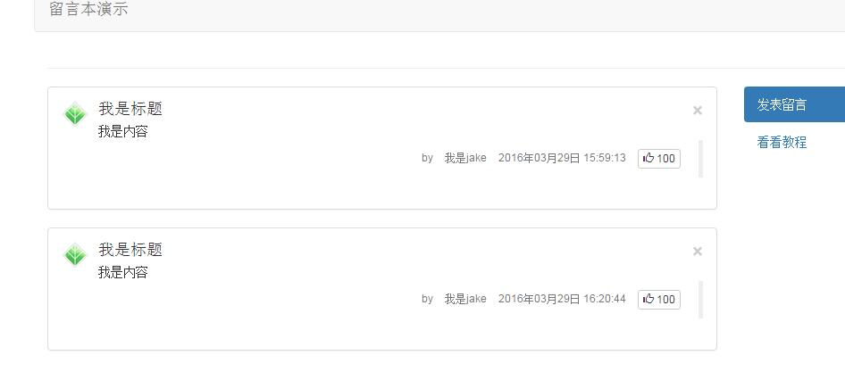

这样我们就完成了初步的留言本开发了，现在可以多发点留言上去试试了哦。

接下来的教程，我们会继续介绍如何扩展这个留言本，让它变得更有趣。