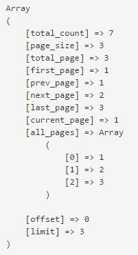

##数据库分页

分页是开发中常见的功能，我们来了解一下sp框架自带的分页功能。

**findAll()第四个参数**

首先我们可以简单地通过设置findAll()查找方法的第四个参数$limit，来进行最简便地分页操作。

这里是入门教程例子：

	function actionIndex(){
		// 接收页码参数
		$page = (int)arg("p", 1);
		
		// 实例化一个guestbook的模型类
		$guestbook = new Model("guestbook");
		// 用findAll()方法查询guestbook表的全部数据
		$this->records = $guestbook->findAll(null, "createtime DESC", "*", array($page, 3));
		// 输出看看
		// dump($this->records);
		
		$this->pager = $guestbook->page;
		// dump($this->pager);

		$this->display("guestbook.html");
	}
    
我们可以看到分页的数据通过$guestbook->page取到了。

字段 | 含义
--- | ---
total_count | 符合条件的总记录数量
page_size | 每页多少条件记录
total_page | 总共有多少页
first_page | 第一页页码
prev_page | 上一页页码
next_page | 下一页页码
last_page | 最后一页页码
current_page | 当前页页码
all_pages | 全部页码数组
offset | 查询位移，等于$limit的第一个参数
limit | 查询条数，等$limit的第二个参数

模板里面的使用方法：

    <{if $pager}>
    <nav>
        <ul class="pagination pull-right">
            <li>
                <a href="<{url c="main" a="index" p=$pager.prev_page}>" aria-label="Previous">
                    &laquo;
                </a>
            </li>
            <{foreach $pager.all_pages as $p}>
            <li<{if $p == $pager.current_page}> class="active"<{/if}>>
                <a href="<{url c="main" a="index" p=$p}>"><{$p}></a>
            </li>
            <{/foreach}>
            <li>
                <a href="<{url c="main" a="index" p=$pager.next_page}>" aria-label="Next">
                    &raquo;
                </a>
            </li>
        </ul>
    </nav>
    <{/if}>
    
**分页的第三个参数**

    $this->records = $guestbook->findAll(null, "createtime DESC", "*", array($page, 3, 10));
    
这里注意一下分页的第三个参数，也就是array($page, 3, 10)的10。

它的意义是“分页显示范围”，会影响到上面分页数据$guestbook->page中的all_pages项。

- 如果当此参数没有设置时，all_pages是从1开始到最后一页的页码。
- 如果设置了“分页显示范围”参数后，all_pages只有这个显示范围那么多个分页。比如说设置成10，那么all_pages就只有10个项。
- 分页显示范围会根据当前页码，自动偏移到适合的页码上，让当前页码尽量显示在页码中间，并且也不会发生页码太多把页码撑开的情况。

**另一种分页使用方法**

以上第一种分页方法，仅能在findAll()方法上面实现。

如果需要执行SQL，如query()的复杂SQL查询。那么就只能通过pager()方法自行计算分页数据了。

pager(）方法：产生分页数据。

用法：pager($page, $pageSize = 10, $scope = 10, $total)

参数：

- $page，当前页码
- $pageSize，每页多少条纪录，也就是分页大小
- $scope，分页显示范围
- $total，总纪录数

这里可以看到，pager()方法比起前面的findAll()仅仅是多了个$total参数。因为像query()的复杂SQL来说，要自动取得符合条件的总数，是比较困难的事情。所以pager()方法把总数交给开发者自行输入。

> 反过来说，findAll()在能力范围内，是可以自动计算出总数的。

所以pager()方法的使用过程是：

1. 通过query()方法，查询到纪录总数$total。或者总数可以不确定，顺便个100也行。
2. 然后调用pager()方法，输入4个参数，得到返回的分页数据。
3. 通过分页数据中的offset和limit两个值，可以构造成SQL语句的LIMIT语句，再给到SQL查询。
4. 最终SQL查询结果，和分页数据一起输入到模板内显示。
